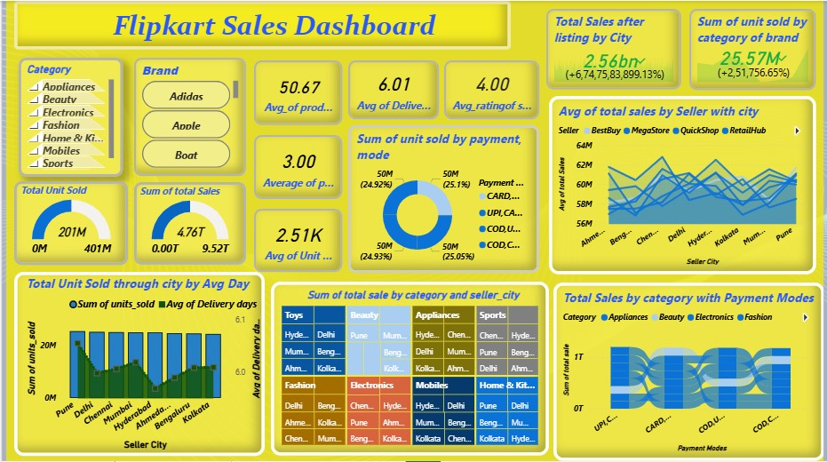

# 🛒 Flipkart Sales Dashboard Analytics

## 📌 Project Description
This project presents an **interactive Flipkart Sales Dashboard** created using **Power BI**, aimed at analyzing end-to-end e-commerce performance.  
It provides insights into **sales trends, customer behavior, logistics efficiency, seller performance, and payment modes**.

The project is also showcased using a **custom HTML portfolio page** for professional presentation.

---

## 🎯 Project Objectives
- Analyze overall **sales and units sold**
- Track **category-wise and brand-wise performance**
- Evaluate **seller and city-level sales**
- Understand **customer payment preferences**
- Measure **logistics efficiency** using delivery metrics

---

## 📊 Key Performance Indicators (KPIs)

| Metric | Value |
|------|------|
| 💰 Total Sales | ₹4.76 Trillion |
| 📦 Total Units Sold | 201 Million |
| 🚚 Avg Delivery Days | 6.0 |
| ⭐ Avg Product Rating | 3.0 / 5 |
| 🛍 Avg Product Price | 50.67 |
| 🧾 Avg Units per Order | 2.51K |

  ## 🖼 Dashboard Preview

## 🔍 Key Insights

- **Strong Overall Sales Performance**  
  Flipkart recorded a total sales value of **₹4.76 Trillion**, indicating high transaction volume across multiple product categories.

- **Electronics and Fashion Drive Revenue**  
  Electronics and Fashion emerged as the **top-performing categories**, contributing the highest share of total sales and units sold.

- **High Sales Concentration in Metro Cities**  
  Cities like **Delhi, Mumbai, Bengaluru, Hyderabad, and Chennai** show consistently higher sales volumes, highlighting strong urban demand.

- **Seller Performance Varies by Location**  
  Certain sellers perform exceptionally well in specific cities, indicating the importance of **regional seller optimization**.

- **UPI and Card Are Preferred Payment Modes**  
  Digital payments (UPI and Cards) dominate over Cash on Delivery, reflecting a shift toward **cashless transactions**.

- **Logistics Efficiency Impacts Customer Experience**  
  The average delivery time of around **6 days** shows reasonable efficiency, but some high-demand cities experience delivery delays.

- **Customer Ratings Influence Sales Trends**  
  Products with higher average ratings tend to achieve better sales, emphasizing the importance of **product quality and customer satisfaction**.

- **Category-Level Demand Patterns Differ**  
  Mobile and Electronics categories show high unit sales, while Appliances and Home & Kitchen generate higher revenue per order.

- **Seasonal and Regional Sales Variation Exists**  
  Sales fluctuate across cities and categories, indicating opportunities for **targeted promotions and inventory planning**.

## 👤 Author

**Abhijeet Roy**  
Data Analyst | Power BI | SQL | Python  

Passionate data analyst with a strong interest in transforming raw data into actionable insights through interactive dashboards and data storytelling.

---

## 📬 Contact Information

- 📧 **Email:** abhijeetjroy@gmail.com  
- 🔗 **LinkedIn:** https://linkedin.com/in/abhijeet-roy-83975a310  
- 💻 **GitHub:** https://github.com/abhijeetjroy-prog  

Feel free to connect with me for collaboration, feedback, or data analytics opportunities.

Flipkart-Sales-Dashboard/
├── Flipkart_Dashboard.pbix
├── Flipkart Image2.jpg
├── index.html
├── Style.css
└── README.md

